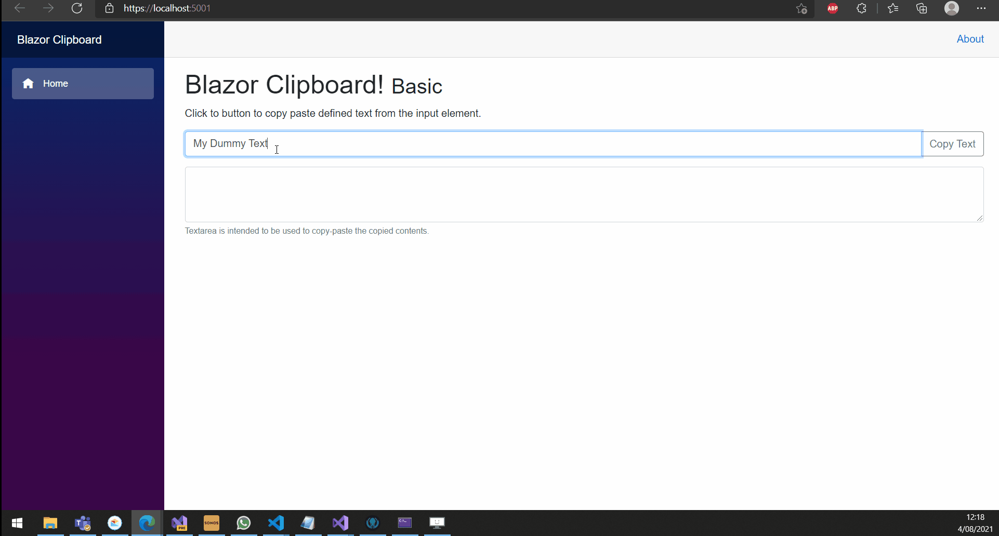

# Clipboard
Implementation of the [Notification API](https://developer.mozilla.org/en-US/docs/Web/API/Clipboard_API) in C# for [Microsoft Blazor](https://github.com/aspnet/Blazor).

[](https://www.nuget.org/packages/Append.Blazor.Clipboard)
[](https://www.nuget.org/packages/Append.Blazor.Clipboard)
[](https://github.com/Append-IT/Blazor.Clipboard/blob/main/LICENSE)

## Preview


## Installation

```
Install-Package Append.Blazor.Clipboard
```

## Demo
There is a sample application in /docs folder which is also hosted as [documentation](https://agreeable-rock-071180b03.azurestaticapps.net). 

## Usage

### Add `IClipboardService` via DI
> Scoped by default.
```csharp
public void ConfigureServices(IServiceCollection services)
{
    services.AddClipboard();
}
```

### Inject into component/pages
```csharp
@using Append.Blazor.Clipboard
@inject IClipboardService ClipboardService
```

or

### Inject on a `BlazorComponent` class:

```c#
[Inject] private IClipboardService _clipboardService { get; set; }
```

### Copy Text
#### Using a Function (basic)
```csharp
await ClipboardService.CopyTextToClipboardAsync("My text to Copy");
```
# Contributions and feedback

Please feel free to use the component, open issues, fix bugs or provide feedback.

# Contributors

This project is created and maintained by:

- [Benjamin Vertonghen](https://github.com/vertonghenb)
